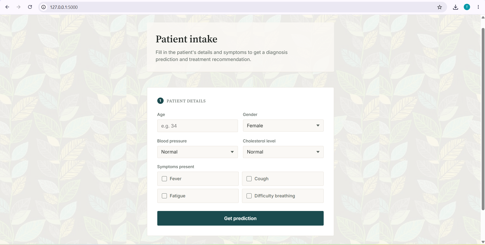
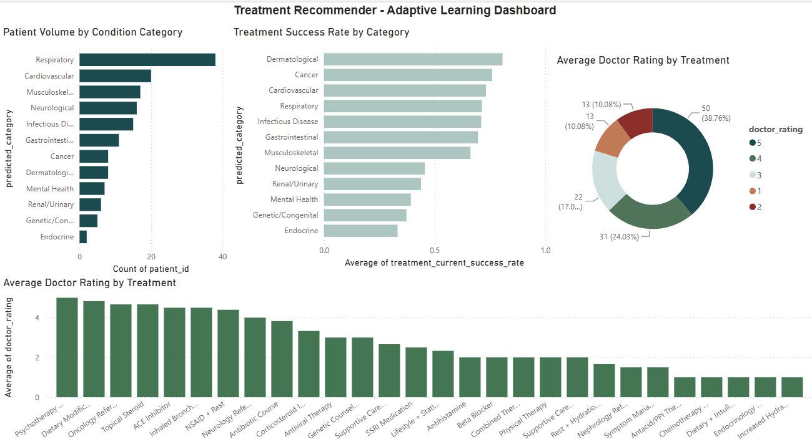

# Personalized Treatment Plan Recommender with Adaptive Learning

A full-stack clinical decision support system that predicts patient condition categories from symptoms and recommends treatments using **Thompson Sampling** - a Bayesian multi-armed bandit algorithm that learns from doctor feedback over time.

Built as a solo portfolio project across 8 phases, combining machine learning, adaptive algorithms, backend development, and data visualization.

---

## Demo




---

## How It Works

```
Patient symptoms entered
        ↓
Random Forest Classifier
(predicts condition category)
        ↓
Thompson Sampling Bandit
(recommends best treatment based on prior ratings)
        ↓
Doctor rates effectiveness (1-5)
        ↓
Beta distribution updates
(bandit learns - better treatments get recommended more often)
```

The key insight: treatments start with equal probability of being recommended. As doctors rate them, the system's confidence in each treatment shifts - good treatments rise, poor ones fall. Over hundreds of patients, the system converges on the most effective treatment per condition category.

---

## Tech Stack

| Layer | Technology |
|---|---|
| Machine Learning | scikit-learn (Random Forest Classifier) |
| Adaptive Algorithm | Thompson Sampling (Beta distribution) |
| Backend | Python, Flask |
| Database | SQLite |
| Frontend | HTML, CSS, JavaScript |
| Data Analysis | pandas, numpy, matplotlib, seaborn |
| Dashboard | Power BI Desktop |
| Dataset | [Kaggle Disease Symptoms Dataset](https://www.kaggle.com/datasets/uom190346a/disease-symptoms-and-patient-profile-dataset) |

---

## Project Structure

```
treatment-recommender/
├── app/
│   ├── app.py               # Flask API + static file serving
│   ├── bandit.py            # TreatmentBandit class (Thompson Sampling)
│   ├── database.py          # SQLite schema + seeding
│   ├── simulate_traffic.py  # Simulated patient traffic generator
│   ├── export_to_csv.py     # Export DB to CSVs for Power BI
│   └── static/
│       └── index.html       # Clinical frontend UI
├── model/
│   ├── diagnosis_model.pkl  # Trained Random Forest model
│   └── label_encoder.pkl    # Condition category label encoder
├── notebooks/
│   └── eda_and_classifier.ipynb  # EDA, preprocessing, model training
├── powerbi_data/
│   ├── dashboard_view.csv   # Denormalized view for Power BI
│   └── treatment_recommender_dashboard.pbix
└── data/                    # Raw Kaggle dataset (not included in repo)
```

---

## Key Design Decisions

**Why Thompson Sampling over simpler approaches?**
Thompson Sampling naturally balances exploration (trying less-tested treatments) and exploitation (recommending proven ones) without any hyperparameter tuning. Each treatment maintains a Beta(α, β) distribution where α tracks successes and β tracks failures. Sampling from these distributions means the system occasionally tries lower-ranked treatments - which is clinically important, since a treatment that works poorly on average might be exactly right for a specific patient profile.

**Why 12 condition categories instead of 116 diseases?**
The raw dataset has 116 disease labels across only 349 rows - an average of 3 examples per disease. Grouping into 12 clinically sensible categories (Respiratory, Cardiovascular, Neurological, etc.) was necessary for the classifier to learn anything meaningful. The tradeoff is acknowledged: the bandit layer operates at the category level, not disease level.

**Classifier performance**
47% accuracy / 0.39 macro F1 across 12 classes on a 70-sample test set. This is roughly 5.6× better than random guessing (8.3% baseline). The limited feature set (4 binary symptoms + age + gender + blood pressure + cholesterol) constrains accuracy; the project's core contribution is the adaptive recommendation layer, not the classifier.

---

## Running Locally

**Requirements**
- Python 3.11+
- pip

**Setup**

```bash
git clone https://github.com/tdillangakoon/treatment-recommender.git
cd treatment-recommender

pip install flask scikit-learn pandas numpy scipy
```

**Initialize the database**

```bash
cd app
python database.py
```

**Start the Flask server**

```bash
python app.py
```

Open your browser at `http://127.0.0.1:5000`

**Optional: Generate simulated patient data**

```bash
python simulate_traffic.py
```

**Optional: Export data for Power BI**

```bash
python export_to_csv.py
```

---

## API Endpoints

| Endpoint | Method | Description |
|---|---|---|
| `/` | GET | Serves the clinical frontend |
| `/predict` | POST | Predicts condition category from patient symptoms |
| `/recommend` | POST | Recommends a treatment using Thompson Sampling |
| `/rate` | POST | Submits a doctor rating, updates the bandit's Beta distribution |

**Example `/predict` request:**
```json
{
  "age": 34,
  "gender": "Female",
  "fever": true,
  "cough": true,
  "fatigue": true,
  "difficulty_breathing": false,
  "blood_pressure": "Normal",
  "cholesterol_level": "Normal"
}
```

**Example `/predict` response:**
```json
{
  "patient_id": 1,
  "predicted_category": "Respiratory"
}
```

---

## Database Schema

```
patients        → age, gender, symptoms, predicted_category
treatments      → treatment_name, condition_category, alpha, beta
recommendations → patient_id, treatment_id, timestamp
ratings         → recommendation_id, doctor_rating, timestamp
```

`alpha` and `beta` in the `treatments` table are live - they update with every `/rate` call, persisting the bandit's learned state across server restarts.

---

## Power BI Dashboard

Four visuals built on simulated usage data (150 patients, ~130 ratings):

- **Patient Volume by Condition Category** - distribution of predicted conditions
- **Treatment Success Rate by Category** - average estimated success rate per category
- **Average Doctor Rating by Treatment** - which treatments doctors rate highest
- **Rating Distribution** - breakdown of 1–5 ratings across all recommendations

---

## Phases

| Phase | Description |
|---|---|
| 1 | Exploratory Data Analysis - class distribution, symptom correlations |
| 2 | Preprocessing - encoding, stratified train/test split |
| 3 | Random Forest Classifier - 12-class multiclass classification |
| 4 | Thompson Sampling - TreatmentBandit class with convergence simulation |
| 5 | SQLite Database - 4-table schema, seeded with 36 treatments |
| 6 | Flask API - 3 endpoints with input validation and error handling |
| 7 | Frontend - progressive clinical intake form with live Beta curve |
| 8 | Power BI - dashboard on simulated usage data |

---

## Author

Thilijana Illangakoon - Undergraduate Data Science student  
[GitHub](https://github.com/tdillangakoon)
